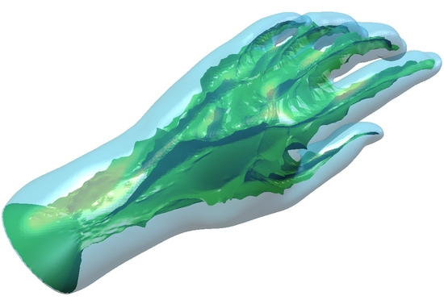
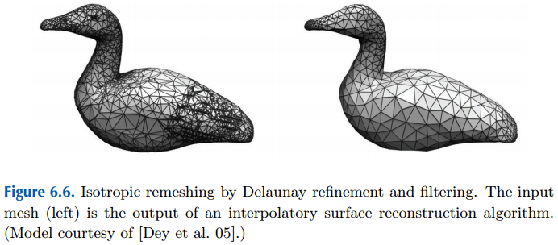

# Remeshing
## Lukas Borges
### 05 Oct 2016
### lborg019@fiu.edu
### [http://lukezin.me](http://lukezin.me)

# What is the purpose of remeshing?
### Mesh quality improvement.

Goals:
- Reduce the complexity of an input surface mesh (simplification).
- Improve quality of a mesh, so that it can be used for different applications (real time rendering).

Definition:
- From one mesh, compute another mesh which preserves key aspects of the original, while satisfying quality requirements.

Assumption:
- We are working on a manifold.

# Computer Models can be obtained from various techniques.
An early technique pipeline used by id Software's Doom (1993) consisted of:
- Modeling in clay
- Taking pictures of the model in different poses
- Scanning the pictures
- Digitizing scanned pictures (spriting)

<!--
    original: 
              .caption Adrian Carmack modeling for id
    markdown:  250 _
-->
<!-- html -->


*Adrian Carmack modeling for id*

## Currently
 

*digitized Doom monster*

we can laser scan an object and generate a mesh from the point cloud:


## The problem?
Meshes generated from laser scanning or modeled in AutoCAD/Rhino/Revit possess high polygonation, improper for real time rendering.
The famous 'Stanford Bunny' model is a mesh reconstructed from a point cloud, and it contains 69,451 triangles


*Stanford Bunny*

Steam recently released .stl files for the Steam Controller, containing nothing less than 6,523,099 polys


*Steam Controller*

## What can be done?
Instead of manually reducing the polycount for such models, we can use algorithms to speed up the process.

- Step 1) Decimate such meshes, in order to automatically reduce poly count.
- Step 2) Remesh in order to improve mesh quality.
- Step 3) Manually correct errors. Remeshing will rarely yield perfect results from the get-go.

## More on mesh quality
We already mentioned how important a lower polycount is important, but what about geometry? Pushing for a quad-dominant mesh (instead of a triangles) has numerous benefits. The book mentions:
"Such quad tilings are amenable to a variety of subsequent applications (...), such as B-spline fitting, simulation, texture atlasing, and rendering with highly detailed modulation maps" (Polygon Mesh Processing, p.104)

## Why all quads?
- Modeling: Wireframe looks cleaner, model is easier to navigate/edit.

- Animation: Quads produce cleaner deformations. When animating (or rigging), adding extra edge loops to increase the geometry is easier.

- UV unwrapping: Also easier when using quads. Less edges cluttering the texture editor.

[more on UV unwrapping (Quixel)](http://quixel.se/tutorial/uv-mapping-for-the-suite/)

- Edge loops: If an edge loop runs into a triangle, the loop is halted, breaking the line's flow.

- Smoothing: Triangles can produce anomalies across the surface of the mesh. Uneven amount of vertices, the triangle can cause blemishes or pinch the geometry (similar might happen with n-gons).

## Why all quads?
- Subdividing:

*Quads:* 4 : 2 = 2 (easy)

*Triangles:* 3 : 2 = 1.5 (hard), how do you resolve the half-part that's left over?

[more on subdivisions (Brainerd)](http://www.graphics.stanford.edu/~niessner/brainerd2016efficient.html)

A more updated research paper by one of the book authors:

[Bommes et al.](http://alice.loria.fr/publications/papers/2012/QuadStar_EG/STAR_quad_meshing.pdf)

# Triangle to Quad conversion methods:

## Method 1:
<!--for whatever reason, 1280 x 812 is the only resolution that fills the entire slide background-->
<!--.background ./bg.png-->


## Method 2:


# Isotropy vs Anisotropy:


Our goal is to try to maximize amount of quads.
An all quad mesh is usually untainable (the torus being one of the exceptions). Usually a quad-dominant mesh suffices.
"Anisotropic meshes are preferred for shape approximation because they usually need fewer elements than their isotropic pendants to achieve the same approximation quality." (Polygon Mesh Processing, p.86)


*[Cinema 4D] after converting parametric cylinder object into polygonal.
It would be hard to represent the round surface cap without anisotropic triangles.*

# Algorithms for surface remeshing
## Triangle-Based Remeshing:
 - Greedy Remeshing
 - Variational Remeshing
 - Incremental Remeshing

## Quad-dominant Remeshing
 - Lines of Curvatures
 - Instant Field-Aligned Meshes
 - Interactively Controlled Quad Remeshing

* Triangle-Based Remeshing:

***
## Greedy Remeshing

Greedy algorithms usually perform one local change at a time (e.g. vertex insertion), until the initially stated goal is satisfied.
Seek to minimze energy functional to a lower level and overall good solution. Solver for this energy usually performs global relaxation i.e., vertex relocations and re-triangulations until convergence.

### *How it works*
*Refines and filters a 3D Delaunay triangulation.*

1) Edges of the Voronoi diagram are used to probe the input surface along the refinement process.
2) Filtering consists of updating the Delaunay triangulation restricted to S denoted [Del(s)P], i.e., selecting the Delaunay facets whose dual Voronoi edges intersect S.

### Delaunay Balls:

Surface Delaunay ball is a ball centered at the input surface S, that circumscribes a facet f of [Del(S)P].
Bf = B(cf, rf), a surface Delaunay ball circumscribing f, centered at cf and of radius rf.


### Medial Axis:

Medial axis M(O) of O is the closure of the set of points with at least two closest points on the boundary of F.
A ball whose bounding sphere intersects the boundary of O is called a *medial ball*


*manifold approximation of the 3D medial axis (camel)*



*manifold approximation of the 3D medial axis (hand)*

[Yoshizawa](http://www.riken.jp/brict/Yoshizawa/Research/Skeleton.html)

[Pereira et al.](http://w3.impa.br/~paesleme/MedialAxis/MedialAxis.html)

[Youtube](https://www.youtube.com/watch?v=uBzveKQt18s)

### Local Feature Size (Local Reach):
Given a smooth manifold M, the local feature size at any point x contained in M is the distance between x and the medial axis of M.
(Distance between any point on a surface to its medial axis).


*2D representation of local feature size (Wikipedia)*

### Refinement Step:

The key idea behind the refinement algorithm is to refine DelS(P) until
all surface Delaunay balls have radius lower than a fraction of the local
reach.

[more on Delaunay Refinement (Shewchuk)](https://www.cs.cmu.edu/~quake-papers/delaunay-refinement.pdf)

*Pseudocode:*
```
  refine()
    while L is not empty
        pop one bad facet f from L
        cf = dual(f) ∩ S
        insert c
        f to P
        update Del(P)
        update DelS(P)
        update(L)

where: f = Delaunay facet,
L = list of bad facets,
S = surface, 
cf = center of facet
P = set
```
and *update(L)* consisting of removal of facets of L that are no longer facets of DelS(P)
addition of new bad facets of DelS(P) to L.

*Results:*



Upon termination, the output of the algorithm (i.e., the piecewise linear interpolation derived from the restricted Delaunay triangulation) is shown to enjoy both approximation guarantees, in terms of topology and geometry, and also quality guarantees, in terms of the shape of the mesh elements.

More precisely, the restricted Delaunay triangulation is homeomorphic to the input surface S and approximates it in terms of its Hausdorff distance¹, normals, curvature, and area.
All angles of the triangles are bounded, which provides us with a mesh quality amenable to reliable mesh processing operations and faithful simulations.

¹Hausdorff distance, measures how far two subsets of a metric space are from each other.

***

## Variational Remeshing
After seeing Greedy Remeshing, the following questions may arise:
Can we construct a mesh of higher quality, with fewer vertices while satisfying the same set of constraints?
variational techniques try to address such questions.

Since we are trying to achieve high-quality meshes, resorting to an optimization procedure might be desirable.

*Two questions arise:*

- Which criterion should we optimize?
- Which degrees of freedom do we use?

An optimization criterion can be directly related to the shape and size of the triangles, but other criteria can achieve satisfactory results as well.
Degrees of freedom are both continuous and discrete (vertex position and mesh connectivity), so we need to narrow the space of possible triangulations.

*Problem*:
optimal mesh is a coarsely defined term. Therefore, choosing one criterion to optimize is difficult, since we could choose optimizing over the triangle angles, edge lengths or compactness of the triangles.
Isotropic remeshing can be cast into the problem of isotropic point sampling, i.e. distributing a set of points on the input mesh in as even a manner as possible.
One approach to this is to construct a centroidal Voronoi tesselation.

Given a density function defined over a bounded domain Omega, a centroidal Voronoi tessellation (CVT) of Omega is a class of Voronoi tessellations where each site coincides with the centroid (i.e., center of mass) of its Voronoi region.


*[Bommes et al] link from slide 10 contains updated information from the book*


The centroid ci of a Voronoi region Vi is calculated as:


where p(x) is the density function which regulates the size of the Voronoi cells.
Its relatioship with the energy function:


with sites pi and corresponding regions Vi beign a proper subset of Omega.
The energy function is minimized when pi are the mass centroids ci of their corresponding regions Vi.


### Algorithm

One way to build a centroid Voronoi tessellation is to use Lloyd's relaxation method, which consists of three steps:
1) Construct the Voronoi tessellation corresponding to the sites pi.
2) Compute the centroids ci of the Voronoi regions Vi using the ci equation aforementioned, and move the sites pi to their respective centroids ci.
3) Repeat steps 1 and 2 until satisfactory convergence is achieved.

*Pseudocode*

```
 isotropic remeshing(input surface triangle mesh M)
    conformal paramerization of M
    compute density function
    perform in parameter space
        random sampling in accordance to the density function
        repeat until convergence
            Voronoi diagram
            relocate sites to Voronoi cell centroids
        lift 2D Delaunay triangulation to 3D
```

*Result*


*Produces isotropic triangle meshes.*

The algorithm takes as input a target edge length and repeatedly splits long edges, collapses short edges, and relocates vertices until all edges are approximately of the desired target edge length.
It follows the following loop:
```
 remesh(target_edge_length)
    low = 4/5 * target_edge_length
    high = 4/3 * target_edge_length
    for i = 0 to 10 do
        split_long_edges(high)
        collapse_short_edges(low, high)
        equalize_valences()
        tangential_relaxation()
        project_to_surface()
```

***
## Incremental Remeshing
Notice that the proper thresholds 4/5 and 4/3 are essential to converge to a uniform edge length.
The values are derived from considerations to make sure that after a split or a collapse function, the edge lengths are closer to the target lengths than before.

The `split_long_edges(high)` function visits all edges of the current mesh.
If an edge is longer than the given threshold `high`, the edge is split at its midpoint and two adjacent triangles are bisected (2-4 split)

```
 split_long_edges(high)
    while exists edge e with length(e) > high do
        split e at midpoint(e)
```


[Shewchuk](https://www.cs.cmu.edu/~quake-papers/delaunay-refinement.pdf)

The `collapse_short_edges(low,high)` function collapses and thus removes all edges that are shorter than a threshold `low`. Here one has to take care of a subtle problem: by collapsing along chains of short edges, the algorithm may create new edges that are arbitrarily long and thus undo the work that was done in `split_long_edges(high)`.

This issue is resolved by checking before each collapse. If a collapse is bound to yield a long edge, it is not executed.

```
 collapse_short_edges(low, high)
    while exists edge e with length(e) < low do
    let e = (a,b) and let a[1],...a[n] be the one-ring of a 
    collapse_ok = true
    for i = 1 to n do
        if length(ba[i]) > high then
            collapse_ok = false
        if collapse_ok then
            collapse a into b along e
```  

The `equalize_valences()` function equalizes the vertex valences by flipping edges.
The target valence `target_val(v)` is 6 and 4 for interior and boundary vertices, respectively. The algorithm tentatively flips each edge e and checks whether the deviation to the target valences decreases. If not, the edge is flipped back

```
 equalize_valences()
    for each edge e do
        let a,b,c,d be the vertices of the two triangles adjacent to e
        deviation_pre = abs(valence(a)-target_val(a))
                      + abs(valence(b)-target_val(b))
                      + abs(valence(c)-target_val(c))
                      + abs(valence(d)-target_val(d))
        flip(e)        
        deviation_post = abs(valence(a)-target_val(a))
                       + abs(valence(b)-target_val(b))
                       + abs(valence(c)-target_val(c))
                       + abs(valence(d)-target_val(d))
        if deviation_pre <= deviation_post do
        flip(e)
```

The tangential `relaxation()` function applies an iterative smoothing filter to the mesh. Here, the vertex movement has to be constrained to the vertex tangent plane in order to stabilize the following projection operator.
Let `p` be an arbitrary vertex in the current mesh, let `n` be its normal, and let `q` be the position of the vertex as calculated by a smoothing algorithm with uniform Laplacian weights (see Chapter 4):


Again, this can be implemented as follows:

```
 tangential_relaxation()
    for each vertex v do
        q[v] = the barycenter of v's neighbor vertices
    for each vertex v do
        let p[v] and n[v] be the position and normal of v, respectively
        p[v] = q[v] + dot(n[v],(p[v]-q[v])) * n[v]
```

Finally, the `project_to_surface()` function maps the vertices back to the surface.

*Results*


***

## Quad-dominant Remeshing:


Automatically converting a triangulated surface (issued, e.g., from a 3D scanner) into a quad mesh is a notoriously difficult task.
Stringent topological conditions make quadrangulating a surface a rather constrained and global problem compared to triangulating it.
Application-dependent meshing requirements such as edge orthogonality, sizing, mesh regularity, orientation, and alignment of the elements with the geometry add hurdles.
Several paradigms have been proposed for generating quadrangle meshes:

- *Quadrangulation:*
A number of techniques have been proposed to quadrangulate point sets.
A subset of these techniques allows generating all-convex quadrangles by adding Steiner points and well-shaped quadrangles using circle packing.
Quadrangle meshing thus amounts to carefully placing a set of points, which are then automatically quadrangulated. The main issue for remeshing is the lack of control of the orientation and alignment of the edges as well as mesh regularity.

- *Conversion*
One way to generate quadrangle meshes is to first generate a triangle or polygon mesh, then convert it to a quad mesh.
Such approach usually consist of pairwise triangle merging (3+3) and 4-8 subdivision, or by bisection of hex-dominant meshes followed by barycentric subdivision.
As for quadrangulation of point sets, this approach provides the user with little control over the orientation and alignment of the mesh edges.

- *Curve-based sampling*
One way to control the edge alignment and orientation of the mesh edges is to place a set of curves that are everywhere tangent to direction fields.
The vertices of the final mesh are obtained by intersecting the networks of curves. When using lines of curvatures, the output meshes are quad-dominant, although not pure quad meshes,
as T-junctions can appear due to the greedy process used for tracing the lines of curvatures. Another approach consists of placing a set of minimum-bending curves.

- *Contouring*
When pure quad meshes are sought after (without T-junctions), a robust approach consists of computing two scalar functions and extracting the quad surface tiling by countouring these functions along well-chosen isovalues.

We will restrict our knowledge to approaches based on curve-based sampling.

***

## Lines of Curvatures
Generates a quad-dominant mesh that reflects the symmmetries of the input shape by sampling the input shape with curves instead of the usual points.
The algorithm comprises three main stages.

*First* it recovers a continuous model from the input triangle mesh by estimating one 3D curvature tensor per vertex.
The normal component of each tensor is then discarded, and a 2D piecewise linear curvature tensor field is nuilt after computing a discrete conformal parametrization.
This tensor field is then altered by linear convolution with a Gaussian kernel to obtain a smoother principal curvature directions.
The singularities of the tensor field are also extracted.


The *second stage* consists of resampling the original mesh in parameter space by building a network of lines of curvatures (a set of “streamlines” approximated by polylines) following the principal curvature directions on anisotropic areas.
On isotropic areas the algorithm resorts to common point sampling (see Figure 6.17). A user-prescribed approximation precision in conjunction with the estimated curvatures is used to define the local density of lines of curvatures at each point in parameter space during the integration of streamlines.

The *third* *stage* deduces the vertices of the new mesh by intersecting the
lines of curvatures in anisotropic areas and by selecting a subset of the umbilics in isotropic areas (estimated to be spherical). The edges are obtained by straightening the lines of curvatures in between the newly extracted vertices in anisotropic areas and are deduced from the Delaunay triangulation in isotropic areas (see Figure 6.18).
The final output is a polygon mesh with mostly elongated quadrangle elements in anisotropic areas and triangles on isotropic areas.

Quads are placed mostly in regions with two estimated axes of symmetry, while triangles are used to either tile isotropic areas or to generate conforming convex polygonal elements.
On flat areas the infinite spacing of streamlines will not produce any polygons, except for the sake of convex decomposition.

- Curvature line tracking and meshing are all done in 3D space. There
is no need to compute a global parameterization such that objects of
arbitrary genus can be processed.

- The algorithm is able to compute a quad-dominant, anisotropic mesh
even in flat regions of the model, where there are no reliable curvature
estimates, by extrapolating directional information from neighboring
anisotropic regions.


***

## Instant Field-Aligned Meshes
Remesh a surface into an isotropic triangular or quad-dominant mesh using a unified local smoothing operator that optimizes both the edge orientations and vertex positions in the output mesh.
It can take in a point cloud (3D scan), range scans, and triangle meshes.

Main steps are local to a vertex and its neighbors. Uses a loose definition of proximity to define neighborhoods.
Unstructured multiresolution hierarchy makes it much faster.
User also has control of the alignment of the edges with a brush (automatic and manual meshing methods), allowing users to control element position in critical regions, while automatically tessellating the rest of the surface.

Local methods (edge swap, collapse and split) along with edge alignment (sketch-based remeshing).

Demo/Code:
[Jakob](https://github.com/wjakob/instant-meshes)

***

## Interactively Controlled Quad Remeshing

Demo/Paper:
[RWTH-Aachen](https://www.graphics.rwth-aachen.de/publication/03266/)

# References:
[Bommes, David et al.](http://alice.loria.fr/publications/papers/2012/QuadStar_EG/STAR_quad_meshing.pdf)

[Botsch, Kobbelt et al.](http://www.pmp-book.org/)

[Brainerd Wade](http://www.graphics.stanford.edu/~niessner/brainerd2016efficient.html)

[Ebke Hans-Christian](https://www.graphics.rwth-aachen.de/publication/03266/)

[Jakob Wenzel](https://github.com/wjakob/instant-meshes)

[Pereira Thiago et al.](http://w3.impa.br/~paesleme/MedialAxis/MedialAxis.html)

[Quixel](http://quixel.se/tutorial/uv-mapping-for-the-suite/)

[Shewchuk Jonathan](https://www.cs.cmu.edu/~quake-papers/delaunay-refinement.pdf)

[VIVALab](https://www.youtube.com/watch?v=uBzveKQt18s)

[Yoshizawa Shin](http://www.riken.jp/brict/Yoshizawa/Research/Skeleton.html)
